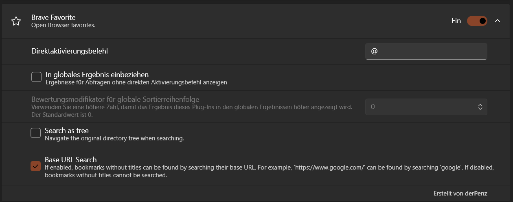

# PowerToys Run: Brave Favorite plugin

This Repository is Forked from davidegiacometti/PowerToys-Run-EdgeFavorite for Brave.

It extends the functionality to allow for searching empty bookmark names

## Installation

- Download the [latest release](https://github.com/Der-Penz/PowerToys-Run-BraveFavorite/releases/) by selecting the
  architecture that matches your machine: `x64` (more common) or `ARM64`
- Close PowerToys
- Extract the archive to `%LOCALAPPDATA%\Microsoft\PowerToys\PowerToys Run\Plugins` or system-wide
  `%ProgramFiles%\PowerToys\RunPlugins`
- Open PowerToys

## Screenshots




## Localization

There is no localization right now, but the plugin has relatively limited user-facing strings.

## Future Plans

- support other browsers
- localization

## Build

```shell
powershell -ExecutionPolicy Bypass .\Build.ps1
```

For developing you can run the underlying powershell script to build the project and automatically copy the project to
your power toys run plugins

```shell
    powershell -ExecutionPolicy Bypass  .\Dev-Build.ps1
```

> Script has to run with admin privileges 

> If you haven't installed powershell system-wide you might need to tweak some paths in `Dev-Build.ps1` to fit your environment

## Contribution

Feel free to contribute to the project. Pull requests are welcome.  
Together we can build the perfect plugin

## Attribution

This repository is a fork of [octop162/PowerToys-Run-ChromeFavorite](https://github.com/octop162/PowerToys-Run-ChromeFavorite), which in turn is based on the original [davidegiacometti/PowerToys-Run-EdgeFavorite](https://github.com/davidegiacometti/PowerToys-Run-EdgeFavorite).

A big thank you to both octop162 and davidegiacometti for their foundational work and contributions to the PowerToys community! 🙏